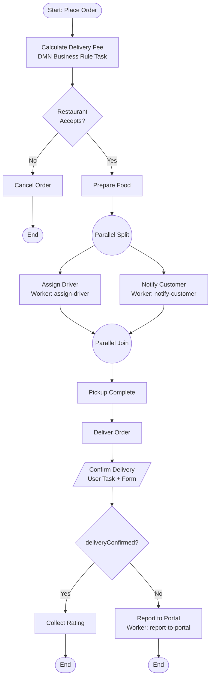
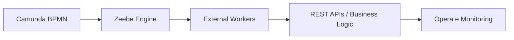

# Camunda BPM Learning Project

A hands-on mini **food-delivery workflow system** built to learn end-to-end
Camunda orchestration — BPMN, DMN, FEEL, Forms, Zeebe Workers, and REST API
integration.

The project evolved from "let me try a Service Task" into a real, working
distributed workflow with parallel processing, decision tables, user tasks,
external workers, and external API callouts.

---

## Table of Contents

1. [What This Project Demonstrates](#what-this-project-demonstrates)
2. [Tech Stack](#tech-stack)
3. [Architecture / BPMN Flow](#architecture--bpmn-flow)
4. [Repository Structure](#repository-structure)
5. [Setup](#setup)
6. [Camunda 8 SaaS Setup & Configuration](#camunda-8-saas-setup--configuration)
7. [How to Run](#how-to-run)
8. [DMN Decision Table](#dmn-decision-table)
9. [User Task + Form](#user-task--form)
10. [Zeebe Workers](#zeebe-workers)
11. [REST API Integration](#rest-api-integration)
12. [Script Tasks (Camunda 7)](#script-tasks-camunda-7)
13. [Process Variables](#process-variables)
14. [Common Errors & Fixes](#common-errors--fixes)
15. [Lessons Learned](#lessons-learned)
16. [Skills Covered](#skills-covered)

---

## What This Project Demonstrates

- Camunda 8 BPMN orchestration on Camunda SaaS
- Camunda 7 Script Tasks (embedded JS)
- DMN decision tables driven by FEEL
- User Tasks backed by Camunda Forms
- Service Tasks executed by external Zeebe workers
- REST API integration via Express + Axios
- Conditional gateways (exclusive + parallel)
- Incident debugging through Camunda Operate
- Process variables flowing across the workflow

---

## Tech Stack

| Layer | Tool |
|---|---|
| Workflow Engine | Camunda 8 (Zeebe, SaaS) + Camunda 7 (for Script Tasks) |
| Modeling | Camunda Modeler (BPMN, DMN, Forms) |
| Monitoring | Camunda Operate |
| Backend | Node.js, Express |
| Workers SDK | `@camunda8/sdk`, `zeebe-node` |
| HTTP Client | Axios |

---

## Architecture / BPMN Flow



### Flow walk-through

1. **Place Order** — customer submits an order.
2. **Calculate Delivery Fee** — `Business Rule Task` invokes the DMN
   `deliveryFeeDecision` and writes `deliveryFee` to process variables.
3. **Restaurant Accepts?** — exclusive gateway on `restaurantAccepted`.
4. **Parallel Gateway** — `Assign Driver` and `Notify Customer` run concurrently
   via two independent Zeebe workers.
5. **Pickup → Deliver** — sequential service steps.
6. **Confirm Delivery** — user task rendered from `confirm-delivery.form`.
7. **Exclusive Gateway** — if `deliveryConfirmed = true` → collect rating;
   otherwise → external grievance API.

---

## Repository Structure

```
camunda-worker/
├── diagram_1.bpmn              # Main BPMN workflow
├── delivery-fee-decision.dmn   # DMN decision table
├── confirm-delivery.form       # Camunda Form (User Task)
├── worker.js                   # Workers: assign-driver + notify-customer
├── reportToPortalWorker.js     # Worker: report-to-portal (calls REST API)
├── server.js                   # Express API exposing POST /grievance
├── package.json
└── README.md
```

---

## Setup

### 1. Install dependencies

```bash
npm install
```

### 2. Configure Camunda 8 SaaS credentials

**Never commit credentials.** Create a `.env` file at the project root:

```env
CAMUNDA_OAUTH_URL=https://login.cloud.camunda.io/oauth/token
ZEEBE_ADDRESS=<your-cluster-id>.<region>.zeebe.camunda.io:443
ZEEBE_CLIENT_ID=<your-client-id>
ZEEBE_CLIENT_SECRET=<your-client-secret>
```

Add `.env` to `.gitignore`:

```gitignore
node_modules/
.env
```

Then update each worker to read from env vars:

```js
require('dotenv').config();
const { Camunda8 } = require('@camunda8/sdk');

const c8 = new Camunda8({
  CAMUNDA_OAUTH_URL: process.env.CAMUNDA_OAUTH_URL,
  ZEEBE_ADDRESS: process.env.ZEEBE_ADDRESS,
  ZEEBE_CLIENT_ID: process.env.ZEEBE_CLIENT_ID,
  ZEEBE_CLIENT_SECRET: process.env.ZEEBE_CLIENT_SECRET,
});
```

Install `dotenv`:

```bash
npm install dotenv
```

### 3. Deploy BPMN, DMN, and Form

In Camunda Modeler:

1. Open `diagram_1.bpmn`.
2. Deploy `diagram_1.bpmn`, `delivery-fee-decision.dmn`, and
   `confirm-delivery.form` to your Camunda 8 cluster.

---

## Camunda 8 SaaS Setup & Configuration

End-to-end walk-through of provisioning a Camunda 8 SaaS cluster, wiring an
external worker to it, and running a BPMN process against it. Use this as the
deeper-dive companion to the quick [Setup](#setup) section above.

### Step 1 — Create a Camunda Cloud Account

Sign up at [https://camunda.io](https://camunda.io) and verify your email.
The free Developer plan is enough for everything in this repo.

### Step 2 — Create a Cluster

In the Camunda Cloud Console:

1. Open **Clusters → Create new cluster**.
2. Pick the **Development** plan and the region closest to you.
3. Wait for the cluster status to turn **Healthy** before continuing.

### Step 3 — Capture Cluster Details

From the cluster overview page, note:

- **Cluster ID** and **Region** — these form your `ZEEBE_ADDRESS`
  (`<cluster-id>.<region>.zeebe.camunda.io:443`)
- **Cluster URL** — used by Operate, Tasklist, and Modeler deployment

### Step 4 — Create an API Client

Under **Cluster → API**:

1. Click **Create new client**.
2. Name it (e.g. `food-delivery-worker`).
3. **Enable the required scopes**: `Zeebe`, `Operate`, and `Tasklist`. Without
   `Zeebe`, the worker cannot poll for jobs.
4. Download the generated credentials **immediately** — the client secret is
   shown only once.

### Step 5 — Save Credentials

Store the credentials in a `.env` file at the project root. Never commit this
file. Use placeholders here and substitute real values locally:

```env
CAMUNDA_OAUTH_URL=https://login.cloud.camunda.io/oauth/token
ZEEBE_ADDRESS=YOUR_CLUSTER_ADDRESS
ZEEBE_CLIENT_ID=YOUR_CLIENT_ID
ZEEBE_CLIENT_SECRET=YOUR_CLIENT_SECRET
```

Add `.env` to `.gitignore`:

```gitignore
node_modules/
.env
```

### Step 6 — Install the SDK and Dependencies

```bash
npm install @camunda8/sdk
npm install dotenv
npm install axios express
```

`@camunda8/sdk` handles OAuth token exchange and gRPC transport to Zeebe.
`dotenv` loads the credentials from `.env` at startup.

### Step 7 — Configure the Worker

Always read credentials from environment variables — never hardcode them in
source:

```js
require('dotenv').config();
const { Camunda8 } = require('@camunda8/sdk');

const c8 = new Camunda8({
  CAMUNDA_OAUTH_URL: process.env.CAMUNDA_OAUTH_URL,
  ZEEBE_ADDRESS: process.env.ZEEBE_ADDRESS,
  ZEEBE_CLIENT_ID: process.env.ZEEBE_CLIENT_ID,
  ZEEBE_CLIENT_SECRET: process.env.ZEEBE_CLIENT_SECRET,
});
```

### Step 8 — Connect to Zeebe

Obtain a Zeebe gRPC client from the SDK instance:

```js
const zbc = c8.getZeebeGrpcApiClient();
```

This single client is reused to create one or more workers.

### Step 9 — Create Workers

Each worker subscribes to a specific `taskType` and returns the variables to
merge back into the process instance:

```js
zbc.createWorker({
  taskType: 'assign-driver',
  taskHandler: async (job) => {
    console.log('Assigning driver for order:', job.variables.orderId);
    return job.complete({
      driverAssigned: true,
      driverName: 'Rahul',
    });
  },
});
```

Use `job.fail(message, retries)` to surface incidents in Operate instead of
silently swallowing errors.

### Step 10 — Configure the BPMN Service Task

In Camunda Modeler, select the Service Task and set:

| Property | Value |
|---|---|
| Implementation | External |
| Task definition → Type | `assign-driver` |

The `Type` value **must match the `taskType` string in `createWorker`
exactly** (case-sensitive). A mismatch is the most common reason a worker
connects successfully but never picks up jobs.

### Step 11 — Deploy the BPMN

From Camunda Modeler:

1. Click **Deploy current diagram**.
2. Choose **Camunda 8 SaaS** as the deployment target.
3. Set the deployment endpoint to your cluster's gRPC address
   (`YOUR_CLUSTER_ADDRESS`) and paste in the same OAuth client credentials
   used by the worker.
4. Deploy `diagram_1.bpmn`, `delivery-fee-decision.dmn`, and
   `confirm-delivery.form` together so DMN and Form references resolve.

### Step 12 — Start a Process Instance

Two options:

- **Modeler**: click the **Play** button on the start event.
- **Operate**: open the process and choose **Start a process instance**.

Provide initial variables, for example:

```json
{
  "customerName": "Viraj",
  "orderAmount": 6000,
  "restaurantAccepted": true,
  "orderId": 999
}
```

### Step 13 — Monitor in Operate

In Camunda Operate you can inspect every running and completed instance:

- **Incidents** — failed jobs, expression errors, missing decisions
- **Variables** — the live state of the instance at each token position
- **Execution path** — the highlighted route the token took through the BPMN
- **Retries** — manually retry a failed job after fixing the worker or BPMN

Operate replaces most `console.log`-driven debugging once the workflow grows
past a handful of steps.

### Camunda Components Used

| Component | Purpose |
|---|---|
| Modeler   | BPMN designing |
| Operate   | Monitoring |
| Tasklist  | User tasks |
| Zeebe     | Workflow engine |
| Workers   | Async task processing |
| DMN       | Decision logic |

### End-to-End Architecture



---

## How to Run

Open three terminals:

```bash
# 1. REST API (grievance endpoint)
node server.js

# 2. Driver + customer notification workers
node worker.js

# 3. Report-to-portal worker
node reportToPortalWorker.js
```

Then start a process instance from **Camunda Operate** or **Tasklist** with
variables like:

```json
{
  "customerName": "Viraj",
  "orderAmount": 6000,
  "restaurantAccepted": true,
  "orderId": 999
}
```

---

## DMN Decision Table

**File:** `delivery-fee-decision.dmn`
**Decision ID:** `deliveryFeeDecision`
**Hit policy:** Unique

| # | orderAmount (input) | deliveryFee (output) |
|---|---|---|
| 1 | `< 500`  | 40 |
| 2 | `>= 500` | 0  |

### BPMN Business Rule Task config

| Property | Value |
|---|---|
| Implementation | DMN Decision |
| Decision ID | `deliveryFeeDecision` |
| Result Variable | `deliveryFee` |

> **Gotcha:** the BPMN Business Rule Task `decisionId` **must match the DMN
> Definitions ID** — not the auto-generated `Definitions_xxxxx`. Otherwise:
> `Expected to evaluate decision 'deliveryFeeDecision', but no decision found`.

---

## User Task + Form

**File:** `confirm-delivery.form`

Single checkbox bound to the process variable:

```
deliveryConfirmed: boolean
```

### Gateway conditions after the user task

| Flow | Condition |
|---|---|
| Yes — Collect Rating | `= deliveryConfirmed = true` |
| No — Report To Portal | default flow |

> Every outgoing flow from an exclusive gateway either needs a FEEL condition
> **or** exactly one flow marked as **default** (wrench icon → *Set as default flow*).

---

## Zeebe Workers

### Worker 1 — `assign-driver` (in `worker.js`)

Sets:

```js
{ driverAssigned: true, driverName: 'Rahul' }
```

### Worker 2 — `notify-customer` (in `worker.js`)

Sets:

```js
{ customerNotified: true }
```

### Worker 3 — `report-to-portal` (in `reportToPortalWorker.js`)

Calls the Express grievance API with order context, then completes the job
with `{ grievanceReported: true }`. On HTTP failure it calls `job.fail(...)`
so the incident is visible in Operate.

---

## REST API Integration

**File:** `server.js`

```js
const express = require("express");

const app = express();
app.use(express.json());

app.post("/grievance", (req, res) => {
  console.log("Received grievance:", req.body);
  res.json({ success: true, message: "Grievance received" });
});

app.listen(3000, () => console.log("API running on port 3000"));
```

The `report-to-portal` worker posts to `http://localhost:3000/grievance` with:

```json
{
  "orderId": 999,
  "customerName": "Viraj",
  "issue": "Delivery Failed",
  "deliveryFee": 40
}
```

---

## Script Tasks (Camunda 7)

Camunda 8 dropped first-class embedded JS in Script Tasks, so the discount
example was practiced in **Camunda 7**.

### Discount script

```js
if (orderAmount > 1000) {
  discount = 20;
} else {
  discount = 5;
}
```

### Script Task config

| Property | Value |
|---|---|
| Format | `javascript` |
| Type | `inlineScript` |
| Result Variable | `discount` |

### Gateway FEEL conditions

| Flow | Condition |
|---|---|
| Yes | `= discount > 10` |
| No  | default flow |

---

## Process Variables

| Variable | Type | Set by | Used by |
|---|---|---|---|
| `customerName` | string | start payload | report-to-portal |
| `orderAmount` | number | start payload | DMN |
| `restaurantAccepted` | boolean | start payload | exclusive gateway |
| `orderId` | number | start payload | report-to-portal |
| `deliveryFee` | number | DMN | report-to-portal |
| `driverAssigned` | boolean | assign-driver worker | downstream visibility |
| `driverName` | string | assign-driver worker | downstream visibility |
| `customerNotified` | boolean | notify-customer worker | downstream visibility |
| `deliveryConfirmed` | boolean | user task form | exclusive gateway |
| `grievanceReported` | boolean | report-to-portal worker | terminal flag |

---

## Common Errors & Fixes

| Error | Root Cause | Fix |
|---|---|---|
| `Expected to evaluate decision 'deliveryFeeDecision', but no decision found` | DMN **Definitions ID** doesn't match BPMN **Decision ID** | Rename DMN `Definitions_xxx` to `deliveryFeeDecision` |
| `FEEL expression failed to parse` | Empty condition / output cells in DMN | Provide valid FEEL on every rule |
| `Must have a condition or be default flow` | Exclusive gateway flow missing condition | Add FEEL or mark a flow as default |
| `ECONNREFUSED localhost:26500` | Worker pointed at a local Zeebe broker that isn't running | Use Camunda SaaS env vars in the SDK config |
| `RST_STREAM` from Zeebe gRPC | Bad auth or wrong SDK config (OAuth URL, cluster address, or client credentials) | Re-check all four env vars; regenerate the API client in the Camunda Cloud Console if needed |
| Worker connects but never picks up jobs | `taskType` in `createWorker` does not match the BPMN Service Task `Task definition → Type` (case-sensitive), or the process was never deployed | Make the strings match exactly, then redeploy the BPMN |

---

## Lessons Learned

- **BPMN is orchestration, not a diagram.** It owns state, retries, and the
  shape of the distributed flow.
- **Decisions belong in DMN, not in code.** Business rules become editable,
  versionable, and reviewable outside engineering.
- **Workers stay dumb and async.** Engine signals work; workers do work and
  publish results back as process variables. Never block the engine.
- **Operate is the debugger.** Variables panel + incident view replaces most
  `console.log`-driven debugging.
- **API orchestration cleans up spaghetti.** Instead of frontend ↔ backend
  point-to-point glue, the BPMN becomes the central coordinator.

---

## Skills Covered

- BPMN modeling (start/end, sequence flows, gateways, tasks)
- DMN decision tables + FEEL
- Camunda Forms + User Tasks
- Service Tasks executed by external Zeebe workers
- Script Tasks (Camunda 7, inline JavaScript)
- Parallel processing via parallel gateways
- Conditional routing via exclusive gateways
- Camunda 8 SaaS connectivity through `@camunda8/sdk`
- REST API integration with Express + Axios
- Process variables and data flow
- Incident resolution in Camunda Operate

---

## Security Notes

- **Do not commit secrets.** `ZEEBE_CLIENT_SECRET` and `ZEEBE_CLIENT_ID`
  belong in `.env` (gitignored) or a secret manager — never in source.
- If credentials were ever pushed, **rotate them in the Camunda Cloud Console**
  and scrub git history (`git filter-repo` or BFG).
- The `/grievance` endpoint is unauthenticated and intended for local learning.
  Before any non-local use, add auth (API key / OAuth), input validation, and
  rate limiting.
